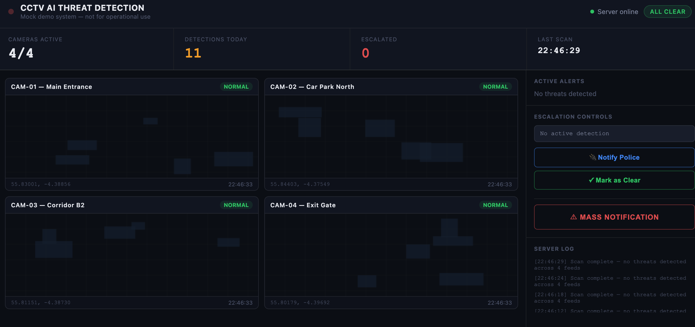

## Important Note 

This was all created by Claude as a way to test out the capabilities.


# CCTV AI Gun Detection Dashboard



A mock browser-based CCTV threat detection system that simulates AI-powered firearm detection across multiple camera feeds. Built as a demo/prototype to showcase how a real-time gun detection dashboard might look and behave — including live alerts, escalation controls, and mass notification.


> **Disclaimer:** This is a mock demo application only. No real AI, no real cameras, no real detection. All threats are randomly simulated by a mock server. Not for operational use.

---

## What the App Does

The dashboard simulates a control room operator's view of 4 CCTV cameras. A mock server runs in the background and randomly triggers firearm detection events across the feeds. When a threat is detected the operator can escalate to police, dismiss the alert, or send a mass notification.

### Features

- **4 live camera feeds** — Main Entrance, Car Park North, Corridor B2, Exit Gate
- **Mock AI detection server** — fires random firearm detection events every ~5 seconds with ~20% probability
- **Threat bounding box** — a red detection box with confidence % appears on the camera feed when a firearm is detected
- **Random GPS coordinates** — each detection generates random lat/lng coordinates (based around Glasgow)
- **Active alerts panel** — lists all current threats with camera, coordinates, time and confidence score
- **Escalation controls:**
  - **Notify Police** — logs the escalation with coordinates, increments the Escalated counter
  - **Mark as Clear** — dismisses the active alert and resets all threat state
  - **Mass Notification** — triggers a full lockdown across all zones
- **Server log** — real-time log of all scan results and escalation actions
- **Metric counters** — tracks cameras active, detections today, escalated count, and last scan time

---

## Project Structure

```
codespaces-blank/
└── cctv-dashboard/
    ├── index.html              ← The full dashboard app (single file)
    └── cctv-cypress/           ← Cypress test suite
        ├── cypress.config.js
        ├── package.json
        ├── README.md
        └── cypress/
            ├── support/
            │   └── commands.js         ← Custom Cypress commands
            └── e2e/
                ├── threat-detection.cy.js
                ├── escalation.cy.js
                └── mark-as-clear.cy.js
```

---

## Running the Dashboard

### Prerequisites

- Node.js installed (already available in GitHub Codespaces)

### Steps

**1. Navigate to the dashboard folder:**
```bash
cd /workspaces/codespaces-blank/cctv-dashboard
```

**2. Start the server on port 3001:**
```bash
npx serve . -p 3001
```

**3. Open the app:**

In GitHub Codespaces, go to the **Ports** tab in VS Code and click the globe icon next to port `3001`. This opens the dashboard in your browser via a URL like:
```
https://curly-potato-7rp54gq44rqfwx9j-3001.app.github.dev
```

> Note: Do not use `localhost:3001` directly in Codespaces — it won't work. Always use the Ports tab URL.

---

## Running the Cypress Tests

### One-time Setup (GitHub Codespaces only)

Codespaces needs a virtual display and some system libraries for Cypress to run. Do this once:

```bash
# Fix apt sources and install all Cypress dependencies
sudo rm /etc/apt/sources.list.d/yarn.list 2>/dev/null || true
sudo apt-get update
sudo apt-get install -y \
  xvfb \
  libatk1.0-0 \
  libatk-bridge2.0-0 \
  libgtk-3-0 \
  libgbm1 \
  libnss3 \
  libxss1 \
  libasound2t64 \
  libxtst6 \
  libglib2.0-0
```

### Running the Tests

You need **two terminals** open at the same time.

**Terminal 1 — start the dashboard:**
```bash
cd /workspaces/codespaces-blank/cctv-dashboard
npx serve . -p 3001
```

**Terminal 2 — run Cypress:**
```bash
cd /workspaces/codespaces-blank/cctv-dashboard/cctv-cypress

# Start virtual display (required in Codespaces)
Xvfb :99 -screen 0 1440x900x24 &
export DISPLAY=:99

# Run all tests
npm test
```

### Running Individual Test Suites

```bash
# Threat detection tests only
npm run test:threat

# Escalation counter tests only
npm run test:escalation

# Mark as clear tests only
npm run test:clear
```

---

## What the Cypress Tests Cover

### 1. `threat-detection.cy.js` — Firearm Alert Tests

Tests that when the mock server detects a firearm, the UI correctly enters alert state.

| Test | What it checks |
|---|---|
| THREAT badge appears | The camera badge changes from NORMAL to THREAT |
| System badge updates | The top-right status badge changes to ALERT |
| Bounding box renders | A red detection box appears on the camera feed |
| Escalation panel updates | Coord display shows the camera name and coordinates |
| Alert list populates | An entry appears in the Active Alerts panel |
| Server log updates | An ALERT line is written to the log |
| Toast notification shows | A popup appears with threat details |
| Server label updates | The server status label changes to THREAT DETECTED |

### 2. `escalation.cy.js` — Detection Counter & Police Notification Tests

Tests that detection counters increment correctly and that notifying police increments the Escalated counter.

| Test | What it checks |
|---|---|
| Detections Today starts at 0 | Counter is 0 on page load |
| Counter increments on detection | Detections Today goes up by 1 per threat |
| Counter increments per detection | Each new threat adds 1 to the count |
| Escalated starts at 0 | Escalated counter is 0 on page load |
| Escalated increments on police notify | Clicking Notify Police adds 1 to Escalated |
| Button shows confirmation state | Button text changes to "Police Notified" after clicking |
| Button resets after 5 seconds | Button returns to default after ~5s |
| Log entry written | An ESCALATED line appears in the server log |
| Toast confirmation shows | A Police Notified toast appears |
| Multiple escalations tracked | Counter correctly increments across repeated escalations |

### 3. `mark-as-clear.cy.js` — Full Reset Tests

Tests that clicking "Mark as Clear" completely resets all alert and threat state across the UI.

| Test | What it checks |
|---|---|
| Camera badge resets | Badge returns to NORMAL |
| Bounding box removed | Detection box disappears from the feed |
| System badge resets | Top-right badge returns to ALL CLEAR |
| Server label resets | Server status returns to "Server online" |
| Alert list clears | Active Alerts panel shows "No threats detected" |
| Coord display resets | Escalation panel shows "No active detection" |
| Log entry written | A cleared line appears in the server log |
| Toast shows | A Cleared toast notification appears |
| Multiple threats handled | Clearing works correctly with more than one active threat |
| Detection counter preserved | Detections Today does NOT reset — history is kept |

---

## Important Note for Tests

The `injectThreat` custom Cypress command calls `window.triggerDetection()` directly on the page to bypass the random mock server timer. Make sure the following line exists at the bottom of the `<script>` block in `index.html`:

```javascript
window.triggerDetection = triggerDetection;
```

Without this, the escalation and mark-as-clear tests will fail when trying to inject a threat programmatically.


